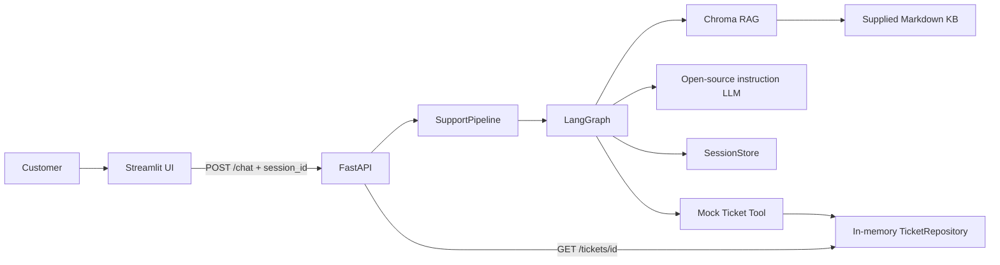

# Architecture

## Turn lifecycle

1. Streamlit creates one UUID for the browser conversation and sends it with every `/chat` request.
2. FastAPI validates the transport model and delegates to `SupportPipeline`.
3. LangGraph retrieves relevant Markdown chunks from the persistent Chroma index.
4. The LLM performs structured intent/field extraction for the current turn. Only values explicitly present in that turn are returned for merging into session state.
5. `answer` uses only retrieved chunks as policy context. If retrieval has no sufficiently relevant evidence, the agent explicitly says the knowledge base does not contain the answer.
6. `ticket` validates all required fields and invokes the session-bound mock ticket tool only after validation succeeds.
7. The repository is idempotent per session, so retries return the existing ticket instead of creating another one.
8. The successful assistant response, sources, and ticket ID are returned by FastAPI and retained by Streamlit across reruns.

## Mid-session requirement

The mid-session behavior is implemented through `session_id` plus `SessionStore`. A customer can provide the ticket fields over multiple turns, for example:

- Turn 1: report the problem and provide a name.
- Turn 2: provide an email address.
- Turn 3: provide the category or remaining issue details.
- Final turn: the validated state is complete and the ticket tool is invoked.

The browser UUID is not regenerated during Streamlit reruns, so the backend continues the same conversation.

## Streamlit Cloud deployment

For Streamlit Cloud, the Streamlit process starts the same FastAPI application in a private background thread. This preserves the required Streamlit -> FastAPI -> LangGraph architecture while avoiding a second public service. The browser never calls FastAPI directly; Streamlit makes the internal HTTP request.
